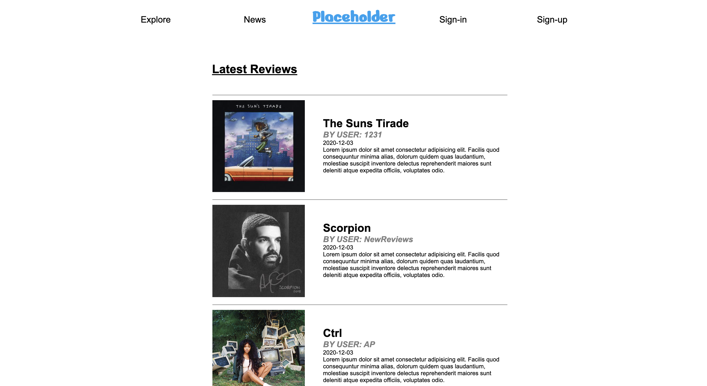

# Color Schemas

### Where to View?

**Here --->** https://music-reviews-sm.herokuapp.com/ (opens in same tab)

### How to Use

This is a social media site that users can upload and view album reviews on. While not logged in, you can view the latest and most popular review, and once logged in you can choose to follow other users so their reviews will show up on your feed.

### Technologies

This app was developed using **HTML5, CSS3, JavaScript** and **Ruby**

### Requirements

- [x] Project wireframes
- [x] Project GitHub repo
- [x] Link to Heroku (or other) deployed project
- [x] Link to source code on GitHub
- [x] README.md
- [x] Demo day: last day of class

### Development

- Planning started on Figma, where I did a quick mock-up of what the different pages would look like
  
- I then planned the database out on a notepad
- I started setting up the database and linking them to make the following user process easier
- Once the layout was setup, I could start programming actual features on my app
- As the progress of the server-side development became clearer, it pushed the progress of the client side further as they were tightly intertwined
- Towards the end, as the biggest features were complete, the process turned into little tasks to optimize the use of my app

### Unsolved Problems

- Not respsonsive
- No like button
- I spent too much time on bug fixes and didn't make the site look as good as I planned
- No follower count or like count
